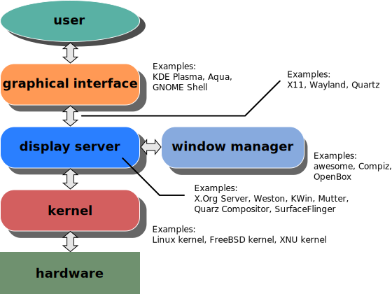

** Regession Warning ** Apologies, code is not currently stable. More quality control will be soon introduced into master branch. if you happen to run the code, and it doesn't work, please try again in a few weeks. For more up to date development information please join the discord below.

# Rabbithole - A Window Management Solution for Laptops with a Changing Number of Displays

Rabbithole is a window manager built on top of the robust Awesome WM (AWM) framework. It's primary purpose is keep your windows organized on your laptop whenever you connect or disconnect an external display.  If you've ever disconnected a display from your laptop and had to reorganize your workspace again before resuming work, then this solution will be for you.  



For more information about rabbithole please see the [wiki]( https://github.com/SaintRyoh/rabbithole/wiki/What-is-Rabbithole ).

## Screenshots and Demonstrations


### Video Demonstrations
* [ Dynamic Display Management demo ](https://www.youtube.com/watch?v=pRu7rNrFJXI)
* [ User Interface Walkthrough ](https://www.youtube.com/watch?v=ci8KCli6YFQ)

## Features
- **Dynamic Display Management**: Disconnect and reconnect screens _on-the-fly_, without interrupting your flow. **Switch workspaces** from your _multi-monitor_ setup to a _single monitor_ setup seamlessly. Click the image link below to see a short YouTube demonstration.
    
- **Streamlined Navigation**: Choose between fully **keyboard-driven** or **mouse-driven** navigation. Switching between applications, workspaces, and displays is a breeze with our **intuitive** controls.

- **Aesthetically Pleasing Experience**: A polished experience that feels more like a Desktop Environment (DE) than a Window Manager (WM). We believe **aesthetics matter**, even outside full desktop environments.
    
- **Personalization**: A neat and centralized settings file that controls everything from theme, to keybindings, to default programs.
    
- **Workspaces**: Different workspaces or _"Activities"_ for different projects. Think of this as a second dimension on top of "tags", or virtual desktops. Separate your workspaces, projects, and flows into different virtual spaces while maintaining global access to applications you need across all workspaces—Email, Discord, Signal, always accessible.
    
- **Quick Program Launch**: Pre-configured **rofi** lets you launch programs or switch windows/workspaces at lightning speed with its fuzzy search algorithm.


## Installation Options 
* [ LXQT based implementation ](https://github.com/SaintRyoh/rabbithole/wiki/Installation) (Recommended)
* XFCE base implementation (Coming soon...)
* Installation Script
* Standalone AUR (advanced/experimental)

## Usage
** Several keybindings start with Windows (mod4 key) **

i3 users will notice the keybindings are very familiar. Non-i3 users, the controls are as intuitive as possible. _If you don't like the controls, let us know, and we can vote on better defaults. We are open to suggestions!_

- ```Win + h``` to see Rabbithole's help and keybindings page.
- ```Win + d``` will open the program launcher.
- ```Win + Tab``` will open your window/task switcher.
- ```Win + f``` will fullscreen your workspace switcher.
- ```Win + q``` will kill the focused app.

### **Mouse**
- Left click and hold on client icons in the tasklist to drag and drop clients from one tag to another
- Right-click tasks to move them between local or global tags and workspaces.
- Middle click tasks/clients to kill them
- Ctrl + Left-click to view multiple tags (virtual desktops) on a single screen
- Win + Right-click on tags to delete, renamme, or move to a different workspace

## Configuring Rabbithole
Rabbithole's configuration file is located in `~/.config/awesome/settings.lua`. When you want to change anything about Rabbithole, this is the place you go.  (Tutorial for settings.lua coming soon, as well as a GUI for it.) We are developing a graphical settings manager for ease of use.

## Community Support
* [GitHub Discussion](https://github.com/SaintRyoh/rabbithole/discussions)
* [Discord](https://discord.com/channels/1122348043950366823/1122348044382392432) 
