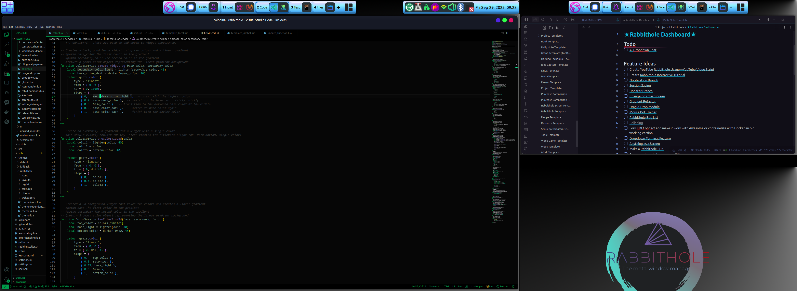

# Rabbithole—The Meta-Window Manager
### LOOKING FOR BETA TESTERS
**Package now available in the AUR** `yay -S rabbithole`, then select Rabbithole from your display manager when you log in!

There is also an automated installer `rabid-installer.sh` working for Arch and Ubuntu Linux - Please Help Us Test On Other Distros & systems if you can. Earn your spot as a [contributor](docs/CONTRIBUTORS.md) to Rabbithole!

### Discord Support
Join  our group on [Rabbithole's Discord](https://discord.com/channels/1122348043950366823/1122348044382392432) for **live support** and to talk to the developers! We're happy to help with anything you need, we are looking for feature requests, feedback, and offer guided-assistance for the installation if you need it. We also love to talk about some pretty meta stuff, so, come join us!


### **Basic Usage Tutorial:** The Windows key on your keyboard has magical powers.
i3 users will notice the keybindings are very familiar. Non-i3 users, the controls are as intuitive as possible. If you don't like the controls, let us know, and we can vote on better defaults. We are open to suggestions!

- **Hit ```Win + h``` to see Rabbithole's help and keybindings page.**
- ```Win + d``` will open the program launcher.
- ```Win + Tab``` will open your window/task switcher.
- ```Win + f``` will fullscreen your workspace switcher.
- ```Win + q``` will kill the focused app.
#### **Mouse**
- Left click and hold on client icons in the tasklist to drag and drop clients from one tag to another
- Right-click tasks to move them between local or global tags and workspaces.
- Middle click tasks/clients to kill them
- Ctrl + Left-click to view multiple tags (virtual desktops) on a single screen
- Win + Right-click on tags to delete, renamme, or move to a different workspace

### Latest Updates & Features
- [x] Install tested & working on Arch, Ubuntu, Void, & Kali (also expected to work on distros based on these))
- [x] Rabbithole will now remember your client locations upon restart
- [x] Dropdown quake style terminal
- [x] Dragging and dropping clients can now move them between tags
- [x] Dozens of minor UI enhancements, leading to a much more polished and fluid experience
- [x] Rabbithole is now available in the AUR with `yay -S rabbithole`
- [x] (In Progress) YouTube tutorial video (install, usage, etc.)
- [x] Improved dynamic display management. Now you can switch between an aribtrary amount of multi-monitor setups, and Rabbithole automatically detects your previous configuration and appies it.
- [x] Many bugfixes

### Upcoming Features
- [x] Automatic seamless session saving (this one's almost done! 24-hours, max)
- [x] Obsidian integration
- [x] Toggleable menubars with options to hide/show on mouse movement'
- [x] A unified appearance to the interface across low and hi-dpi monitors. Bypassing X11's limitaton of one DPI for all screens, and giving every Rabbithole user and identical experience
- [x] Custom systray
- [x] Advanced Notification Center
- [x] (Optional) side-saddle titlebars (we're getting rid of the "Nice" library)
- [x] Easier settings management via standalone settings manager app
- [x] More customizable settings.lua (size/location of widget bars)
- [x] Minor Bugfixes
- [x] Performance improvements

## _Enter the Rabbithole._
_Video demonstration when you click on the image below._
[](https://youtu.be/ci8KCli6YFQ)

## Table of Contents
- [About](#about)
- [What is a Meta-Window Manager?](#what-is-a-meta-window-manager)
- [Features](#features)
- [Ideal For](#ideal-for)
- [Installation](#installation)
    - [Prerequisites](#prerequisites)
    - [Dependencies](#core-packages-only-advanced-users)
    - [Tutorial](#tutorial)
    - [Automated Installer](#automated-installer-recommended)
    - [Manual Installation](#manual-installation)
- [Post Installation](#post-installation)
- [Configuring Rabbithole](#configuring-rabbithole)
- [Contributing](#contributing)
- [The Vision of Rabbithole (Planned Features)](#the-vision-of-rabbithole-planned-features)

## About Rabbithole
A _revolutionary_ kind of window manager that takes productivity to a _**whole new dimension**_ (quite literally). Rabbithole is not just another window manager—it is a dynamic, fluid, and interactive environment that challenges conventional paradigms of what a WM is for. It breathes life into your workspace and transforms the way you interact with your computer. It can also act as a full drop-in replacement for the window manager of your favorite Desktop Environment (DE) and reap all of the combined benefits.

Built on the robust **Awesome WM framework**, Rabbithole embraces the philosophy of dynamic workspaces. It allows you to nest virtual workspaces and add or remove displays on-the-fly. With Rabbithole, you don't adjust to your workspace, your workspace adjusts to _you_.

## What is a Meta-Window Manager?

Rabbithole is the _first **meta-window manager**_ because it goes beyond traditional window management—it is a _philosophy_ on how we believe windows should be managed. Rabbithole is not just about managing windows; it's about _redefining_ how they can be used to enhance your **workflow**.

## Features

- **Dynamic Display Management**: Disconnect and reconnect screens _on-the-fly_, without interrupting your flow. **Switch workspaces** from your _multi-monitor_ setup to a _single monitor_ setup seamlessly. Click the image link below to see a short YouTube demonstration.
[](https://youtu.be/pRu7rNrFJXI?si=kSLEeJKNB4FuoH2Y)
    
- **Aesthetically Pleasing Experience**: A polished experience that feels more like a Desktop Environment (DE) than a Window Manager (WM). We believe **aesthetics matter**, even outside full desktop environments.
    
- **Streamlined Navigation**: Choose between fully **keyboard-driven** or **mouse-driven** navigation. Switching between applications, workspaces, and displays is a breeze with our **intuitive** controls.
    
- **Personalization**: With Rabbithole's own **Tesseract Theme Engine**, add a _primary color_, select a _color theory_, and generate your unique and beautiful themes, adhering to **Material Design 3** standards and color theory rules.
    
- **Workspaces**: Different workspaces or _"Activities"_ for different projects. Think of this as a second dimension on top of "tags", or virtual desktops. Separate your workspaces, projects, and flows into different virtual spaces while maintaining global access to applications you need across all workspaces—Email, Discord, Signal, always accessible.
    
- **Centralized Settings**: A neat and centralized settings file that controls everything from theme, to keybindings, to default programs.
    
- **Quick Program Launch**: Pre-configured **rofi** lets you launch programs or switch windows/workspaces at lightning speed with its fuzzy search algorithm.

## Ideal For

Rabbithole is ideal for users who:

- Appreciate the power of window managers but don't want to deal with the hassle of customizing from scratch.
    
- Seek an aesthetically pleasing workspace, but are tired of the rigid, or dated appearance of traditional window managers.
    
- Want their computer interface to be more than a tool—an extension of their minds, a second brain.
    
- Frequently switch between different monitor setups and need a workspace that can adjust on-the-fly.
    
- Desire a streamlined, intuitive workspace that boosts productivity without sacrificing user experience.

## Installation

**Rabbithole is now available in the AUR** with `yay -S rabbithole`. No extra steps needeed, just select **Rabbithole** from your display manager/login screen.

If you want to install Rabbithole manually, or with the automated `rabid-installer.sh`, because the AUR package isn't feasible, please follow our [Installation Guide](docs/README-Installation.md)

### Prerequisites

Rabbithole is designed for use on Linux operating systems. To use Rabbithole, you should:

- Have a working Linux installation. Rabbithole has been [tested](#looking-for-beta-testers) and is known to work on: Arch, Garuda, Ubuntu, Kali.
- Have **git** installed. If you don't have git installed, you can install it with your distribution's package manager. For example, on Ubuntu, you can install git with the following command: ```sudo apt install git```
- Have an AUR package helper installed, if you are on an Arch system (unless you use the rabid-installer)

## Dependencies

### Core Packages Only (Advanced Users)

These are the dependencies you need if you are going to manually install all of your systray programs and really know what you are doing when it comes to window managers. Only recommended for experienced users who want to build their environment themselves manually. You will still have to go through [post installation](#post-installation) to configure Rabbithole properly.

```
lxqt
awesome
rofi
rofi-themes-collection-git
picom
autorandr
ttf-ubuntu-font-family
beautyline
tmux
```
### DE-Like Experience Packages (Recommended)
```
lxqt
awesome
rofi
rofi-themes-collection-git
picom
autorandr
ttf-ubuntu-font-family
beautyline
volumeicon
lxqt-policykit
lxqt-powermanagement
network-manager-applet
blueman-git
flameshot
linux-wifi-hotspot
tmux
```

If you choose to install package-by-package manually, follow the same [post installation steps](docs/README-Installation.md#post-installation) in the automated installation procedure.

## Configuring Rabbithole
Rabbithole's configuration file is located in ```~/.config/awesome/settings.lua```. When you want to change anything about Rabbithole, this is the place you go. You should never have to modify Rabbithole's source code. As new features are added, they will have their options added to settings.lua.
Here you can add startup programs and daemons to the list under the appropraite tables. (Tutorial for settings.lua coming soon, as well as a GUI for it.)

### Contributing

We are looking for contributors to join the team. Right now we have accomplished a lot between two extremely tight-knit engineers with the same vision, and complementary programming (with 15 years of pair-programming experience). We are looking for others who sharte our vision (or can be molded)!

What is our vision, you ask?

### The Vision of Rabbithole

Rabbithole is more than just software—it's a journey into the future of digital spaces, and we have the roadmap charted out. It's a long one.

With our current version to 1.x, we have crafted a promising open beta and v1 as our proof-of-concept, which is our first step into this grand adventure. Our intention is not only to showcase the potential of Rabbithole, but also to invite the community into the development process. We are eager to know your thoughts, ideas, and feedback as we strive to fill a distinct, yet unexplored niche that caters to users like us.

As we finish up the remainder of unfinished features for v1 (and the bugs that undoubtedly come with it), we plan to immediately progress to version 2.x. We have already identified a host of enhancements and features we want to incorporate. We love Awesome WM, but its incompatibility with Wayland and the bugs laden within picom have motivated us to push the boundaries, because we have pushed AWM near its limitations. Even though X isn't disappearing anytime soon, we are setting our sights towards the future of Virtual Reality (VR) and Augmented Reality (AR) interfaces. We have a few options in front of us. But this will likely require programming an entirely new framework from the ground up, or continuing where others have left off. We are open to ideas.

Our grand vision is to morph Rabbithole into an AI-powered virtual interface that offers full compatibility with all of your devices. Be it your mobile, PC, or VR/AR headsets, we aim to provide a seamless, unified, and immersive experience across all platforms. We are already feeling concrete about the next framework to build Rabbithole v2.x with.

#### About Rabbithole's Philosophy of Being a Second-Brain Interface

_"Building a Second Brain"_ and _"Getting Things Done"_ (GTD) are two significant productivity philosophies that Rabbithole integrates at its core.

"Building a Second Brain" is a methodology for saving and systematically reminding us of the ideas, inspirites, and random useful bits we've come across, to free our minds from the job of remembering. This approach aligns perfectly with Rabbithole, which aims to create an adaptive workspace that adjusts to the user's needs—acting as a _'second brain'_ that understands and adapts to the user's workflows.

On the other hand, "Getting Things Done" is a time-management method, which encourages recording tasks externally and breaking them down into actionable work items. This allows users to focus on performing tasks instead of remembering them. Rabbithole's fluid window management complements this by making sure that your digital workspace is always optimized for the task at hand, which in turn aids in the GTD methodology.

Rabbithole believes that a window manager is not just a tool to manage applications but a critical element of your productivity toolbox. It can significantly affect how efficiently you work and how quickly you can switch between tasks. In essence, a good window manager helps you build your second brain and aids in getting things done.

We see Rabbithole as the ultimate bridge that connects the islands of mobile and desktop computing, culminating in a singular, coherent user experience. Join us in our journey to make this vision a reality.
