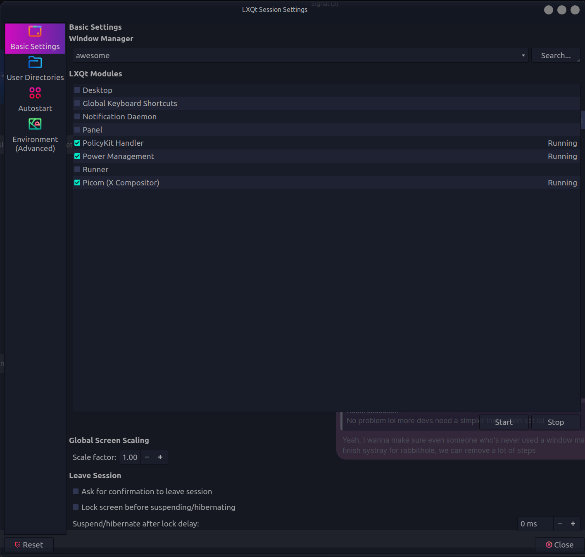
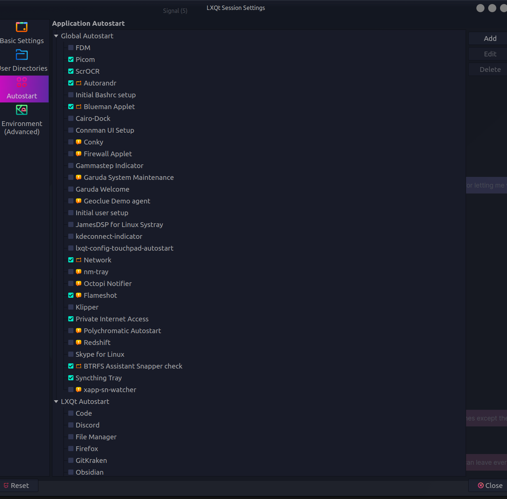

# Rabbithole—The Meta-Window Manager

_Enter the Rabbithole._


### LOOKING FOR BETA TESTERS

We need people to test the installation procedure and give us feedback before we start major promotion. Earn your spot as a [contributor](docs/CONTRIBUTORS.md) to Rabbithole!

### Testers - Signal Group Chat Support
Download [Signal](https://signal.org/download/) or [Signal Desktop](https://signal.org/download/) to Join Support! You can also join support on [Rabbithole Discord](https://discord.com/channels/1122348043950366823/1122348044382392432) and sometimes on the [HaxMe](https://discord.gg/PwMuxBNZ) Discord.
```
https://signal.group/#CjQKIHyjLO9067HgV_M2AF3WvW1Ork7-c7R4I0V0N95RQ42kEhA7LqbgBjsKwCnspOEfA3_J
```
## Table of Contents
- [What is a Meta-Window Manager?](#what-is-a-meta-window-manager)
- [Features](#features)
- [Ideal For](#ideal-for)
- [Installation](#installation)
- [Post Installation](#post-installation)
- [Contributing](#contributing)
- [The Vision of Rabbithole (Planned Features)](#the-vision-of-rabbithole-planned-features)

A _revolutionary_ window manager that takes productivity to a _**whole new dimension**_ (quite literally). Rabbithole is not just another window manager—it is a dynamic, fluid, and interactive environment that challenges conventional paradigms of window management. It breathes life into your workspace and transforms the way you interact with your computer.

Built on the robust **Awesome WM framework**, Rabbithole embraces the philosophy of dynamic workspaces. It allows you to nest virtual workspaces and add or remove displays on-the-fly. With Rabbithole, you don't adjust to your workspace, your workspace adjusts to _you_.

## What is a Meta-Window Manager?

Rabbithole is the _first **meta-window manager**_ because it goes beyond traditional window management—it is a _philosophy_ on how we believe windows should be managed. Rabbithole is not just about managing windows; it's about _redefining_ how they can be used to enhance your **workflow**.

## Features

- **Dynamic Display Management**: Disconnect and reconnect screens _on-the-fly_, without interrupting your flow. **Switch workspaces** from your _multi-monitor_ setup to a _single monitor_ setup seamlessly.
    
- **Aesthetically Pleasing Experience**: A polished experience that feels more like a Desktop Environment (DE) than a Window Manager (WM). We believe **aesthetics matter**, even outside full desktop environments.
    
- **Streamlined Navigation**: Choose between fully **keyboard-driven** or **mouse-driven** navigation. Switching between applications, workspaces, and displays is a breeze with our **intuitive** controls.
    
- **Personalization**: With Rabbithole's own **Tesseract Theme Engine**, add a _primary color_, select a _color theory_, and generate your unique and beautiful themes, adhering to **Material Design 3** standards and color theory rules.
    
- **Workspaces**: Different workspaces or _"Activities"_ for different projects. Think of this as a second dimension on top of "tags", or virtual desktops. Separate your workspaces, projects, and flows into different virtual spaces while maintaining global access to applications you need across all workspaces—Email, Discord, Signal, always accessible.
    
- **Centralized Settings**: A neat and centralized settings file that controls everything from theme, to keybindings, to default programs.
    
- **Quick Program Launch**: Pre-configured **rofi** lets you launch programs or switch windows/workspaces at lightning speed with its fuzzy search algorithm.

## Ideal For

Rabbithole is ideal for users who:

- Appreciate the power of window managers but don't want to deal with the hassle of customizing from scratch.
    
- Seek an aesthetically pleasing workspace, but are tired of the rigid, or dated appearance of traditional window managers.
    
- Want their computer interface to be more than a tool—an extension of their minds, a second brain.
    
- Frequently switch between different monitor setups and need a workspace that can adjust on-the-fly.
    
- Desire a streamlined, intuitive workspace that boosts productivity without sacrificing user experience.

## Installation
```shell
git clone https://github.com/SaintRyoh/rabbithole
cd rabbithole && git submodule update --init
./rabid-installer.sh
```
You can also simply copy or symlink the config to your Awesome WM configuration directory after initializing the submodules:
```shell
cp -R rabbithole ~/.config/awesome
```
Or make a symlink
```
ln -s ~/path/of/rabbithole ~/.config/awesome
```

### Post-Installation
Note: We plan on removing LxQt as a dependency when the systray is complete.
1. Start up lxqt from your display-manager

2. Open lxqt-config -> Session Settings
3. In Basic Settings, select "awesome" as your window manager
4. Stop and uncheck all services, besides PolicyKit, Power Management, and Picom

5. Make sure autorandr is on. Also make sure Network, and whatever else you need is still checked off, and disable whatever you don't need.

6. Restart lxqt to begin using Rabbithole!

## Manual Installation
Make sure the dependencies are installed (lxqt, awesome, rofi, ttf-ubuntu-font-family, rofi-themes-collection):
1. Void Linux:

```
bash

sudo xbps-install -Su awesome picom rofi lxqt
```

2. Arch-based:
```
bash

sudo pacman -Syu lxqt awesome picom rofi ttf-ubuntu-font-family
```
3. Gentoo:
```
bash

sudo emerge --ask x11-wm/awesome x11-misc/picom x11-misc/rofi
```

Rofi themes collection and Ubuntu Font Family installation remain the same across distributions:

#### Clone the Rofi themes collection:
```
bash

mkdir -p "$HOME/.local/share/rofi/themes"
git clone https://github.com/newmanls/rofi-themes-collection.git "$HOME/.local/share/rofi/themes"
```
#### Install the Ubuntu Font Family Manually:
```
bash

sudo mkdir -p "/usr/share/fonts/ubuntu-font-family"
sudo wget -O "/usr/share/fonts/ubuntu-font-family/Ubuntu.zip" https://assets.ubuntu.com/v1/fad7939b-ubuntu-font-family-0.83.zip
sudo unzip "/usr/share/fonts/ubuntu-font-family/Ubuntu.zip" -d "/usr/share/fonts/ubuntu-font-family
```
Repeat the same [post installation steps](#post-installation) in the automated installation procedure.

### [Contributing](README.md#contributing)

We are looking for contributors to join the team. Right now we have accomplished a lot between two extremely tight-knit engineers, with the same vision, and complimentary programming (with 15 years of pair-programming experience). We are looking for others who fit (or can be molded)!

What is our vision, you ask?

### [The Vision of Rabbithole (Planned Features)](https://github.com/SaintRyoh/rabbithole/tree/master/README.md#the-vision-of-rabbithole-planned-features)

Rabbithole is more than just software—it's a journey into the future of digital spaces, and we have the roadmap charted out. It's a long one.

With our current version to 1.x, we have crafted a promising open beta and v1 as our proof-of-concept, which is our first step into this grand adventure. Our intention is not only to showcase the potential of Rabbithole, but also to invite the community into the development process. We are eager to know your thoughts, ideas, and feedback as we strive to fill a distinct, yet unexplored niche that caters to users like us.

As we finish up the remainder of unfinished features for v1 (and the bugs that undoubtedly come with it), we plan to immediately progress to version 2.x. We have already identified a host of enhancements and features we want to incorporate. We love Awesome WM, but its incompatibility with Wayland and the bugs laden within picom have motivated us to push the boundaries, because we have pushed AWM near its limitations. Even though X isn't disappearing anytime soon, we are setting our sights towards the future of Virtual Reality (VR) and Augmented Reality (AR) interfaces. We have a few options in front of us. But this will likely require programming an entirely new framework from the ground up, or continuing where others have left off. We are open to ideas.

Our grand vision is to morph Rabbithole into an AI-powered virtual interface that offers full compatibility with all of your devices. Be it your mobile, PC, or VR/AR headsets, we aim to provide a seamless, unified, and immersive experience across all platforms.

About the "Building A Second Brain" and "Getting Things Done" concepts that fit into Rabbithole's philosophy:

_"Building a Second Brain"_ and _"Getting Things Done"_ (GTD) are two significant productivity philosophies that Rabbithole integrates at its core.

"Building a Second Brain" is a methodology for saving and systematically reminding us of the ideas, inspirites, and random useful bits we've come across, to free our minds from the job of remembering. This approach aligns perfectly with Rabbithole, which aims to create an adaptive workspace that adjusts to the user's needs—acting as a _'second brain'_ that understands and adapts to the user's workflows.

On the other hand, "Getting Things Done" is a time-management method, which encourages recording tasks externally and breaking them down into actionable work items. This allows users to focus on performing tasks instead of remembering them. Rabbithole's fluid window management complements this by making sure that your digital workspace is always optimized for the task at hand, which in turn aids in the GTD methodology.

Rabbithole believes that a window manager is not just a tool to manage applications but a critical element of your productivity toolbox. It can significantly affect how efficiently you work and how quickly you can switch between tasks. In essence, a good window manager helps you build your second brain and aids in getting things done.

We see Rabbithole as the ultimate bridge that connects the islands of mobile and desktop computing, culminating in a singular, coherent user experience. Join us in our journey to make this vision a reality.
