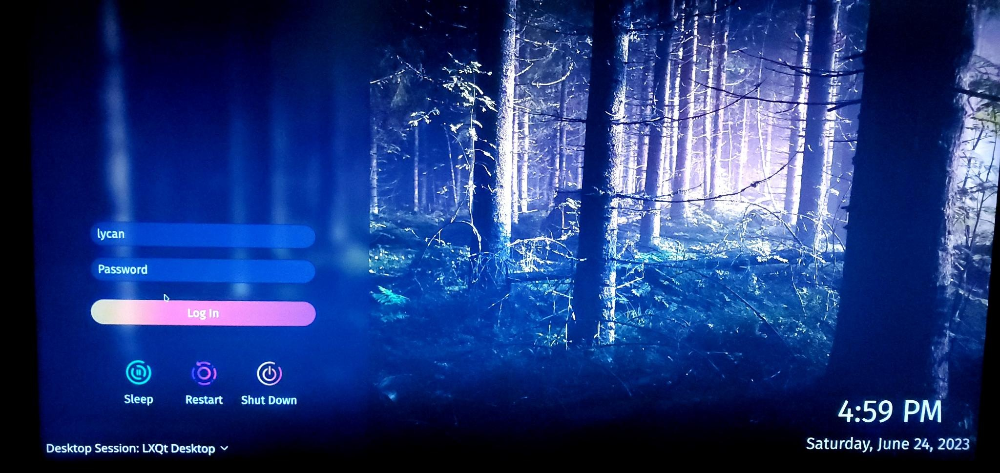
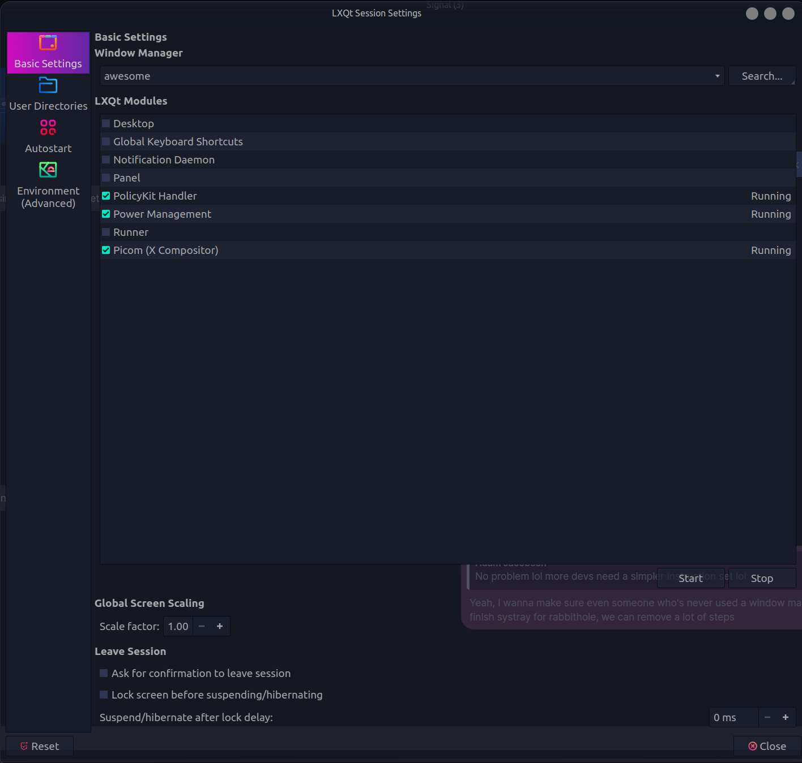
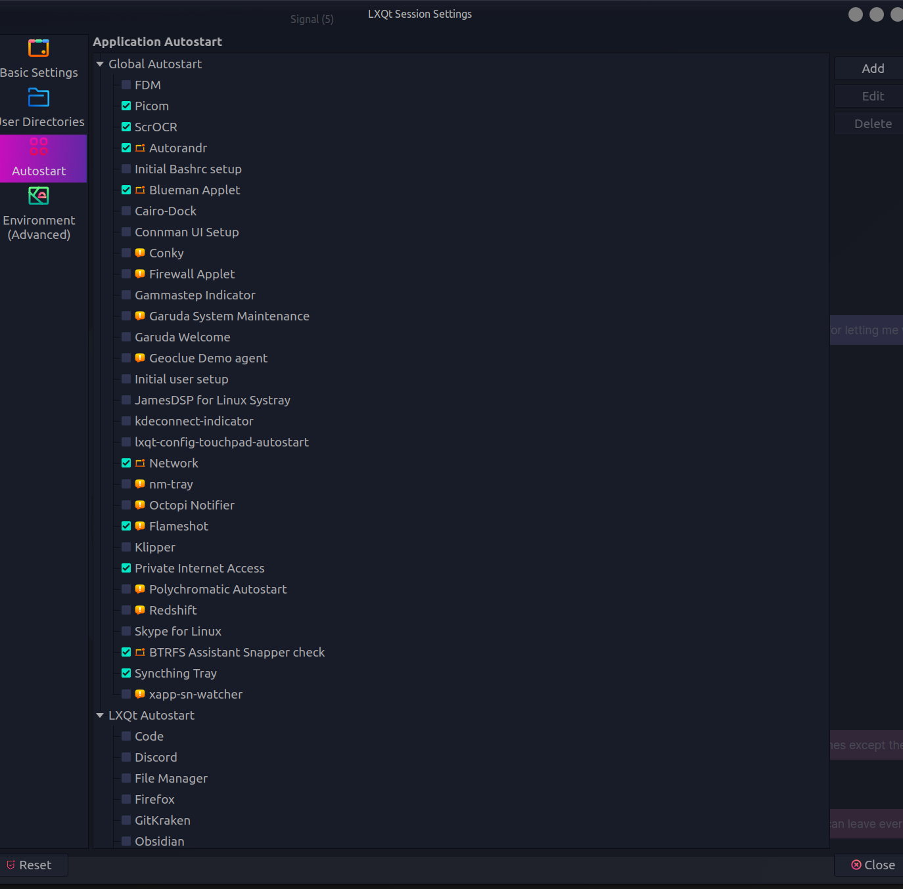

## LxQt-Installation
Note: We plan on removing LxQt as a dependency when the systray is complete.
1. Start up lxqt from your display-manager in the session menu before logging in.

2. Open lxqt-config -> Session Settings.
3. In Basic Settings, select "awesome" as your window manager.
4. Stop and uncheck all services, besides PolicyKit, Power Management, and Picom.

5. Make sure autorandr is on. Also make sure Network, and whatever else you need is still checked off, and disable whatever you don't need.

6. Restart lxqt to begin using Rabbithole!